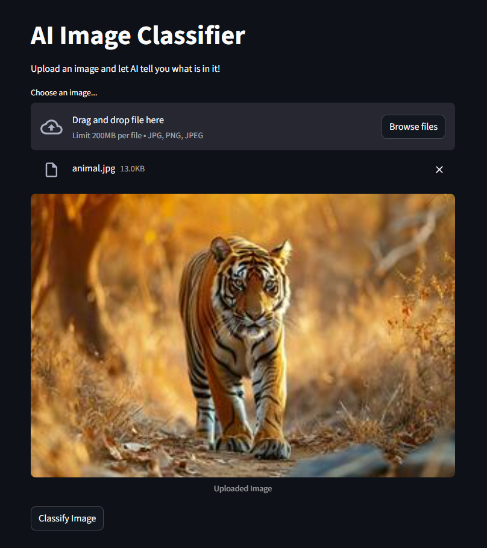
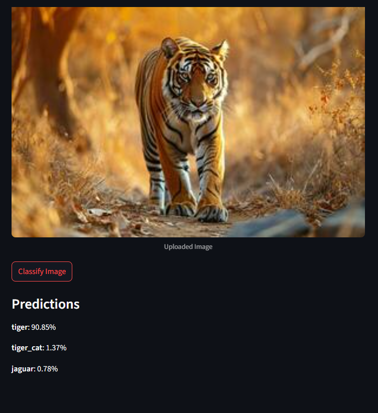

# 🖼️ Image Classifier Web App

A Streamlit-powered web application that classifies images using TensorFlow's MobileNetV2 model. Perfect for quick prototyping and educational purposes!

[](https://image-classify.streamlit.app/)

## 🚀 Quick Start

### Prerequisites
- Python 3.8-3.10
- pip or conda

## 📸 Example Classifications

<div align="center">
  <!-- Replace with your demo GIF -->
  
</div>
<div align="center">
  <!-- Replace with your demo GIF -->
  
</div>

### Installation
```bash
# Clone this repository
git clone https://github.com/Nazmul-Arefin/Image-Classifier
cd image-classifier

# Create virtual environment (recommended)
python -m venv venv
source venv/bin/activate  # Linux/Mac
.\venv\Scripts\activate   # Windows

# Install dependencies
pip install -r requirements.txt


